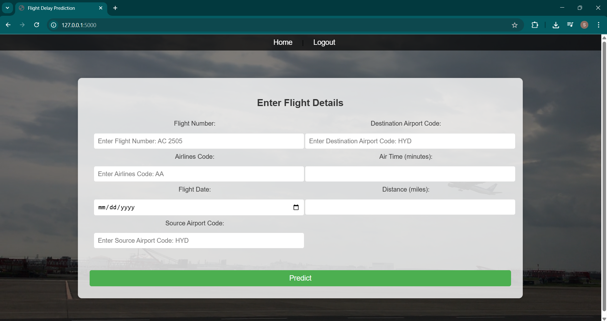

# ✈️ Flight Delay Prediction Web App (ML + Flask + MySQL)

This project is a **machine learning-powered Flask web application** that predicts whether a flight is likely to be delayed and estimates the delay in minutes. It features **user authentication**, **MySQL integration**, and a **PyTorch-trained model** to provide real-time predictions based on flight details.

# View the demo of the project:
[](https://www.youtube.com/watch?v=Bye2DSy-W-I)


---

## Problem Statement

Flight delays are a significant concern in the aviation industry, impacting passengers, airlines, and logistics. This project aims to predict:

- **Whether a flight will be delayed**
- **Estimated delay time in minutes**

---

## Machine Learning Overview

- **Model Type**: Binary classification + regression (delay time)
- **Framework**: PyTorch
- **Input Features**:
  - Air time
  - Distance
- **Model Outputs**:
  - Predicted probability of delay
  - Estimated delay time (in minutes)
- **Scaler**: `StandardScaler` used for feature normalization
- **Model Storage**:
  - Model stored in `model.pth`
  - Scaler stored in `scaler.pkl`

---

## Application Features

- 🔐 **User Authentication**
  - Login / Signup / Logout
  - Passwords hashed and stored using `Werkzeug` + SQLAlchemy
- 📈 **Prediction Interface**
  - Users can input flight data to get predictions
  - Displays prediction results with context
- 💾 **Database Integration**
  - Backend powered by **MySQL**
  - User data stored in a `users` table

---

## Tech Stack

| Layer          | Technology              |
|----------------|--------------------------|
| Frontend       | HTML (Jinja Templates)    |
| Backend        | Flask                     |
| ML Framework   | PyTorch                   |
| Database       | MySQL + SQLAlchemy        |
| Others         | NumPy, Scikit-learn, Pickle, PyMySQL |

---

## Setup Instructions

### 1. Clone the Repository

```bash
git clone https://github.com/sameeratanveer/transport-flight-delay-prediction-flask.git
cd flight-delay-prediction
```

### 2. Set Up Virtual Environment

```bash
python -m venv venv
source venv/bin/activate   # On Windows: venv\Scripts\activate
```

### 3. Install Dependencies
```
pip install -r requirements.txt
```

### 4. Configure Database
Create a MySQL database:
```
CREATE DATABASE flight_delay_pred_db;
```
then run:
```
python
>>> from app import db
>>> db.create_all()
>>> exit()
```

### 5. Add Model and Scaler
Make sure the following files are present in the project root:

model.pth — Trained PyTorch model file

scaler.pkl — Fitted scaler file

### 6. Run the app:
```
python app.py
```
Visit the application in your browser at:
```
http://localhost:5000
```

## Sample Prediction Flow
1. Register / Log in

2. Enter details:

Flight Number

Airport Code

Flight Date

Source & Destination

Air Time

Distance

3. View:

Whether the flight will be delayed

Delay duration (if any)
